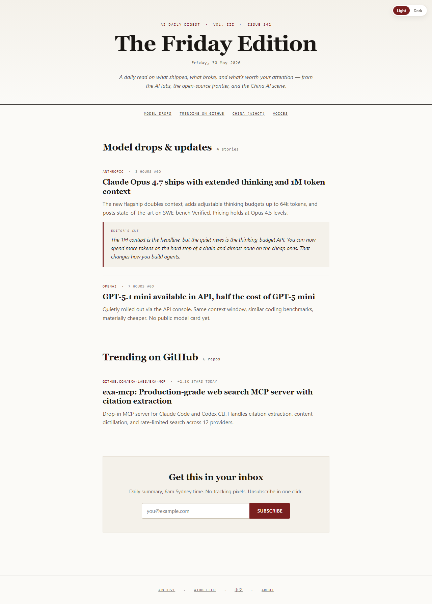
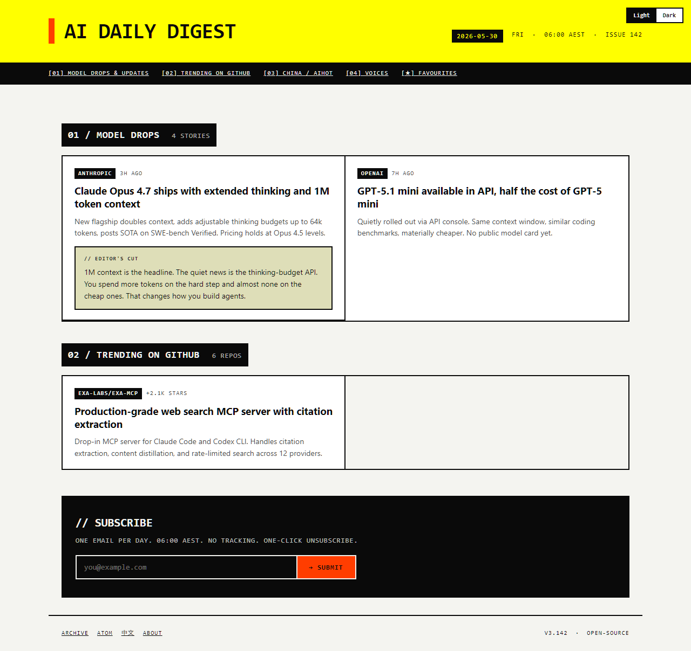
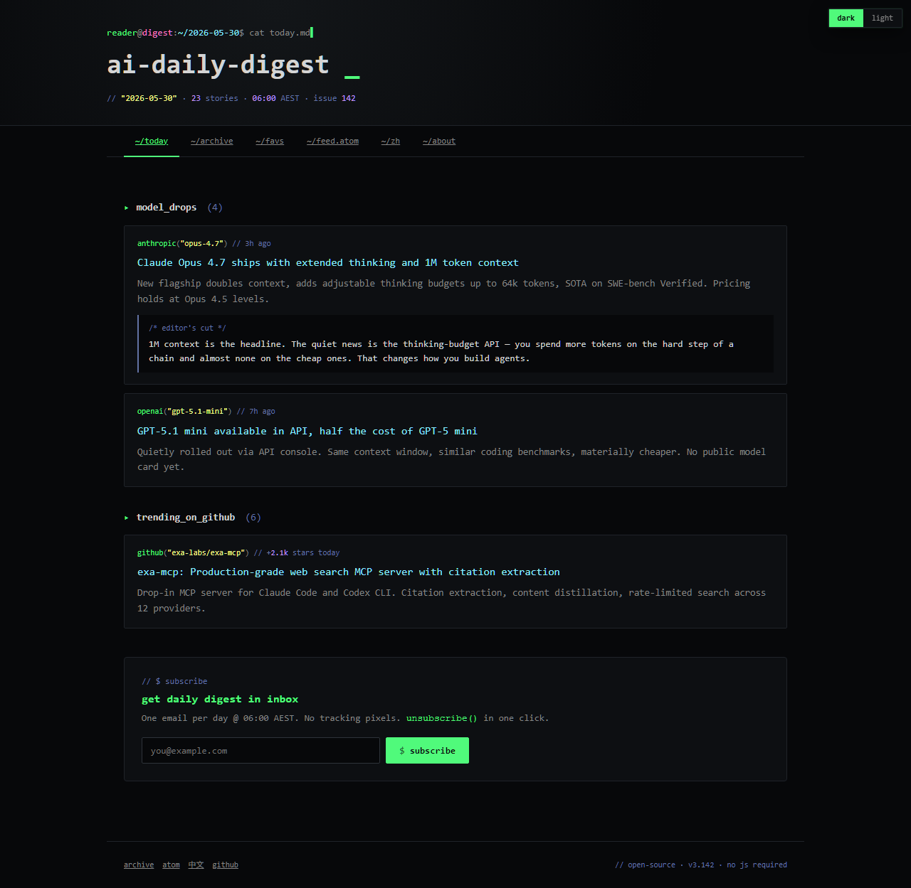
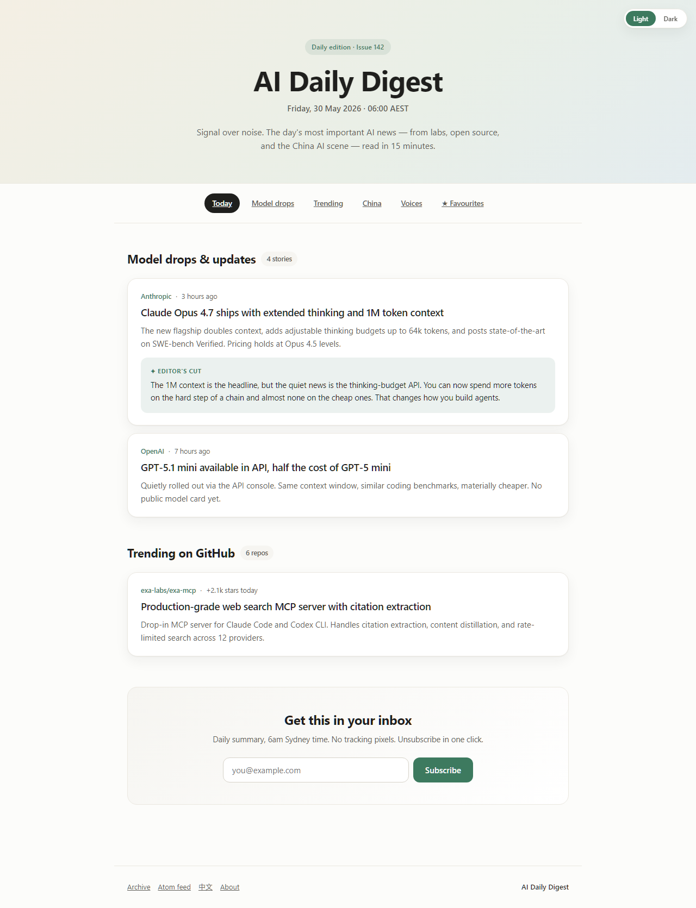
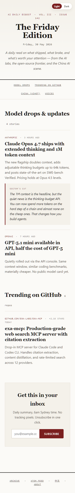
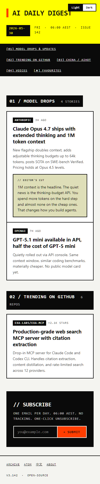
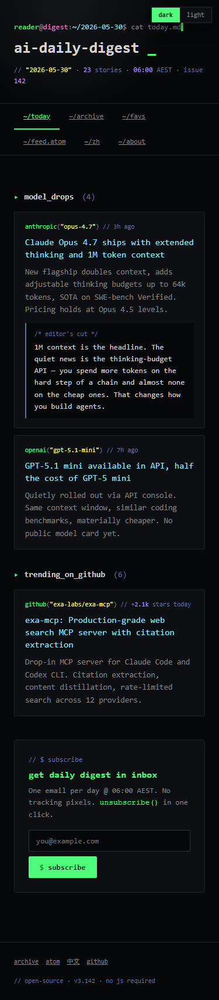
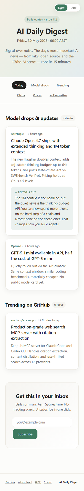

# Theme Shotgun — AI Daily Digest

Four distinct theme directions explored on `feat/backend-and-editorial-layer`
because the current `linear` and `claude` themes felt mediocre. Each
direction is a fundamentally different aesthetic stance, not a tweak.

## Directions

| # | Slug | Aesthetic stance | Best for | Visit |
|---|------|-----------------|----------|-------|
| 1 | `editorial` | NYT-Wirecutter / Substack premium. Serif display, oxblood single accent, mono metadata, content-first hierarchy. | Readers who treat news as ritual. The Editor's Cut becomes the centrepiece. | [preview](/designs/backend-and-editorial-layer/theme-shotgun/theme-editorial/preview.html) · [rationale](theme-editorial/RATIONALE.md) |
| 2 | `brutalist` | Linear marketing + Ben Holliday. Zero radius, hard 2px borders, hazard-yellow masthead, signal-orange accent, mono everywhere. | Readers who keep Hacker News open in another tab. Tools, not entertainment. | [preview](/designs/backend-and-editorial-layer/theme-shotgun/theme-brutalist/preview.html) · [rationale](theme-brutalist/RATIONALE.md) |
| 3 | `cyber` | Terminal / Dracula-derived. JetBrains Mono everywhere, syntax-highlight palette, shell-prompt masthead with blinking cursor. | The r/LocalLLaMA / model-trafficker audience. Closest match to the product's stated sources. | [preview](/designs/backend-and-editorial-layer/theme-shotgun/theme-cyber/preview.html) · [rationale](theme-cyber/RATIONALE.md) |
| 4 | `soft` | Modern contemporary. System fonts, sage-green accent (not the SaaS-blue default), warm off-white, soft three-colour hero gradient, 12px card radius. | Broader audience — PMs, designers, AI-curious technical readers. | [preview](/designs/backend-and-editorial-layer/theme-shotgun/theme-soft/preview.html) · [rationale](theme-soft/RATIONALE.md) |

## How to evaluate

Open all four previews and ask yourself, in order:

1. **Which one fits the voice of the Editor's Cut?** The cut is the
   product's signature. Look at how each theme renders it: pull-quote
   (editorial), sticky note (brutalist), `/* comment */` (cyber), tinted
   card (soft). The right theme is the one where the cut feels at home.
2. **Which audience expansion does the product want?** Editorial expands
   into the magazine-reader audience. Brutalist holds the technical
   audience and signals serious. Cyber narrows tightly to the
   model-trafficker. Soft expands into a broader audience but loses
   distinctness.
3. **Which one survives bilingual EN+中文?** Editorial and soft handle
   CJK gracefully (serif and system fonts respectively). Cyber's
   mono-everywhere bet weakens in CJK. Brutalist's hard borders and
   uppercase chrome translate fine to CJK structurally but lose some
   character.
4. **Which one is the brand for years, not just for now?**

## Screenshots

Each theme captured at desktop (1280×720 viewport) and mobile (375×812).
Full-page captures, so heights vary.

### Desktop

| Editorial | Brutalist | Cyber | Soft |
|-----------|-----------|-------|------|
|  |  |  |  |

### Mobile

| Editorial | Brutalist | Cyber | Soft |
|-----------|-----------|-------|------|
|  |  |  |  |

## Implementation shape

Each theme ships as a folder with three files:

```
theme-shotgun/theme-<slug>/
├── tokens.css       # design tokens; same shape as scripts/render-site.mjs PAGE_CSS
├── preview.html     # standalone HTML preview (no renderer dependency)
└── RATIONALE.md     # design language, who it's for, what it sacrifices
```

Token names match `scripts/render-site.mjs` `PAGE_CSS` so the renderer can
swap themes by swapping the tokens file. The only token-shape addition is
`--mono-font` for the editorial/cyber themes (used for metadata).

All four themes commit `data-theme="<slug>-light"` and `data-theme="<slug>-dark"`.
The renderer's theme toggle would gain the chosen theme as a third option
alongside `linear` and `claude` — or fully replace the current two if the
new direction is decisive.

## Process notes

- Real product copy throughout. No lorem ipsum.
- Same content in every preview: Anthropic Opus 4.7 drop, OpenAI GPT-5.1
  mini, exa-mcp on GitHub. Editor's Cut on the Opus story. So the visual
  difference is purely the theme, not the content.
- Each theme is a separate atomic commit on `feat/backend-and-editorial-layer`.
- See individual `RATIONALE.md` files for "what it sacrifices" — every
  direction trades something away. None of these is purely safe.
